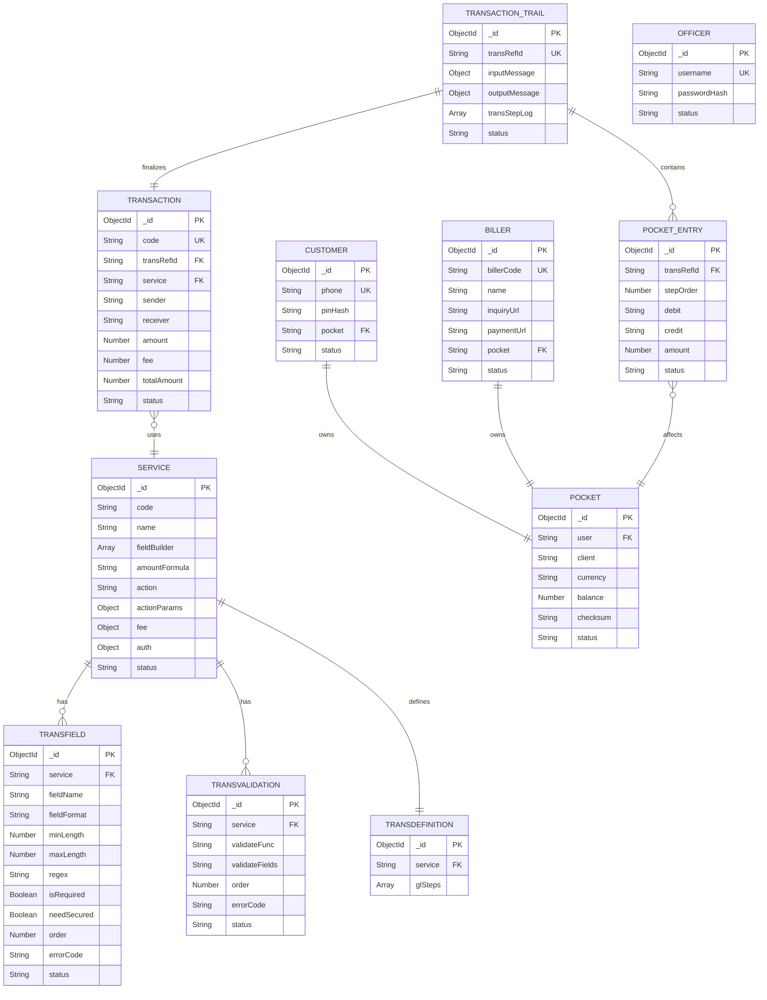

# ERD & Data Dictionary

## 1. Data Domains

Hệ thống được chia thành 3 khu vực lưu trữ tách biệt hoàn toàn về bản chất logic:

### Miền Configuration

Lưu trữ cấu hình sinh ra từ Officer. Dữ liệu này đóng vai trò như "bản vẽ kỹ thuật", chủ yếu được đọc (Read) bởi Engine tại thời điểm chạy (runtime).

### Miền Ledger & Engine

Quản lý trạng thái luồng 3 bước (Trail) và các biến động tài chính (Pocket, Entry, Transaction). Khu vực này là lõi của hệ thống, yêu cầu tính chính xác tuyệt đối và được ràng buộc bởi ACID Transaction.

### Miền Entity

Quản lý định danh của các chủ thể sở hữu ví hoặc thao tác với hệ thống (Customer, Officer, Biller).

---

## 2. Entity Relationship

### Configuration Domain

- `Service` đóng vai trò trung tâm.
- `Service` liên kết **1-N** với `TransField` (kiểm tra định dạng) và `TransValidation` (luật nghiệp vụ) thông qua khóa ngoại `String(service._id)`.
- `Service` liên kết **1-1** với `TransDefinition` (kịch bản ghi sổ kép - `glSteps`) thông qua trường `service`.

### Ledger Domain

- Mỗi `Customer` hoặc `Biller` liên kết **1-1** với một `Pocket`.

- Hệ thống cũng khởi tạo các Pocket đặc biệt như:
  - `System Pocket`
  - `Bank Pocket`

- `TransactionTrail` được nhận diện xuyên suốt bằng `transRefId` (Unique Index), trong khi khóa chính vẫn là `_id` mặc định của MongoDB.

- Sau khi Verify thành công:
  - Một `TransactionTrail` liên kết **1-1** với `Transaction`.
  - Một `TransactionTrail` liên kết **1-N** với `PocketEntry`.

- Tất cả tham chiếu nghiệp vụ sử dụng `transRefId`.

---

# 3. Data Dictionary

## 3.1. Miền Configuration

### Model: Service

Mô tả danh tính nghiệp vụ, luật dựng biến ban đầu, phí và cơ chế xác thực.

| Thuộc tính    | Kiểu dữ liệu | Mô tả & Ràng buộc                                                                            |
| ------------- | ------------ | -------------------------------------------------------------------------------------------- |
| \_id          | ObjectId     | Khóa chính                                                                                   |
| code          | String       | Mã nghiệp vụ duy nhất (VD: P2P_TRANSFER, CASH_IN)                                            |
| name          | String       | Tên hiển thị                                                                                 |
| fieldBuilder  | Array        | Mảng object dựng biến: `{ order, name, rule, source, variable, query, datatype, errorCode }` |
| amountFormula | String       | Công thức tính gốc                                                                           |
| action        | String       | `none` (P2P, Cash-in) hoặc `billerTrans` (Bill Payment)                                      |
| actionParams  | Object       | Tham số phụ, VD: `{ billerId: "EVN" }`                                                       |
| fee           | Object       | `{ type: 'fixed'/'percent', value: Number, max: Number }`                                    |
| auth          | Object       | `{ method: 'PIN'/'NONE' }`                                                                   |
| status        | String       | `active` / `inactive`                                                                        |

**Rule hỗ trợ trong fieldBuilder**

- `fixed`
- `mapping`
- `query`

---

### Model: TransField

Định dạng dữ liệu cho từng biến trong `TRANSBODY`.

| Thuộc tính  | Kiểu dữ liệu | Mô tả & Ràng buộc                    |
| ----------- | ------------ | ------------------------------------ |
| \_id        | ObjectId     | Khóa chính                           |
| service     | String       | FK → Service (`String(service._id)`) |
| fieldName   | String       | Tên biến (bắt buộc có `SERVICEID`)   |
| fieldFormat | String       | `string`, `number`, `boolean`        |
| minLength   | Number       | Độ dài tối thiểu                     |
| maxLength   | Number       | Độ dài tối đa                        |
| regex       | String       | Mẫu kiểm tra                         |
| isRequired  | Boolean      | Bắt buộc                             |
| needSecured | Boolean      | Che log                              |
| order       | Number       | Thứ tự kiểm tra                      |
| errorCode   | String       | Mã lỗi                               |
| status      | String       | `active` / `inactive`                |

---

### Model: TransValidation

Luật nghiệp vụ chạy trước khi thay đổi tiền.

| Thuộc tính     | Kiểu dữ liệu | Mô tả & Ràng buộc              |
| -------------- | ------------ | ------------------------------ |
| \_id           | ObjectId     | Khóa chính                     |
| service        | String       | FK → Service                   |
| validateFunc   | String       | Tên hàm validator              |
| validateFields | String       | VD: `SENDERID:AMOUNT:DEBITFEE` |
| order          | Number       | Thứ tự chạy                    |
| errorCode      | String       | Mã lỗi                         |
| status         | String       | `active` / `inactive`          |

---

### Model: TransDefinition

Kịch bản ghi sổ kép.

| Thuộc tính | Kiểu dữ liệu      | Mô tả & Ràng buộc                                                    |
| ---------- | ----------------- | -------------------------------------------------------------------- |
| \_id       | ObjectId          | Khóa chính                                                           |
| service    | String / ObjectId | FK → Service                                                         |
| glSteps    | Array             | `{ order, amount, debit: {level, target}, credit: {level, target} }` |

> **Ghi chú**
>
> - `level = productLevel`: Tra động từ biến trong `TRANSBODY`.
> - `level = wallet`: ID ví cố định.
>-  Các biến như `DEBITFEE`, `TOTALAMOUNT` không cần khai báo trong `fieldBuilder`.
>
> - Core Engine sẽ tự động tính toán từ `Service.fee` và inject vào `TRANSBODY` để `glSteps` và `TransValidation` sử dụng.

---

## 3.2. Miền Ledger & Engine

### Model: Pocket

Sổ ghi nhận số dư.

> Chỉ được cập nhật bằng native `$inc` bên trong Database Transaction.

| Thuộc tính | Kiểu dữ liệu      | Mô tả & Ràng buộc                      |
| ---------- | ----------------- | -------------------------------------- |
| \_id       | ObjectId          | Khóa chính                             |
| user       | String / ObjectId | FK → Customer / Biller                 |
| client     | String            | `customer`, `biller`, `system`, `bank` |
| currency   | String            | VD: `VND`                              |
| balance    | Number            | Số dư thực tế                          |
| checksum   | String            | Hash bảo vệ tính toàn vẹn dữ liệu      |
| status     | String            | `active`, `locked`, `inProgress`       |

---

### Model: TransactionTrail

Hồ sơ toàn vẹn giao dịch 3 bước.

| Thuộc tính    | Kiểu dữ liệu | Mô tả                                             |
| ------------- | ------------ | ------------------------------------------------- |
| \_id          | ObjectId     | Khóa chính MongoDB                                |
| transRefId    | String       | Unique Index                                      |
| inputMessage  | Object       | Request payload gốc                               |
| outputMessage | Object       | TRANSBODY sau chuẩn hóa                           |
| transStepLog  | Array        | Log từng bước xử lý                               |
| status        | String       | `init → pending → done / failed / refund_pending` |

---

### Model: PocketEntry

Nhật ký bút toán (Immutable).

| Thuộc tính | Kiểu dữ liệu | Mô tả                 |
| ---------- | ------------ | --------------------- |
| \_id       | ObjectId     | Khóa chính            |
| transRefId | String       | FK → TransactionTrail |
| stepOrder  | Number       | Khớp với glSteps      |
| debit      | String       | Pocket bị trừ         |
| credit     | String       | Pocket được cộng      |
| amount     | Number       | Giá trị luân chuyển   |
| status     | String       | Mặc định `settled`    |

---

### Model: Transaction

Biên lai cuối cùng trả cho người dùng.

| Thuộc tính  | Kiểu dữ liệu | Mô tả                     |
| ----------- | ------------ | ------------------------- |
| \_id        | ObjectId     | Khóa chính                |
| code        | String       | VD: `TXN-12345`           |
| transRefId  | String       | FK → TransactionTrail     |
| service     | String       | FK → Service              |
| sender      | String       | ID hoặc Phone người gửi   |
| receiver    | String       | ID, Phone hoặc Mã hóa đơn |
| amount      | Number       | Tiền gốc                  |
| fee         | Number       | Phí giao dịch             |
| totalAmount | Number       | Tổng tiền bị trừ          |
| status      | String       | `done` / `failed`         |

---

## 3.3. Miền Entity (Định danh & Đối tác)

### Model: Customer

| Thuộc tính | Kiểu dữ liệu | Mô tả               |
| ---------- | ------------ | ------------------- |
| \_id       | ObjectId     | Khóa chính          |
| phone      | String       | Unique Index        |
| pinHash    | String       | Hash bcrypt của PIN |
| pocket     | String       | FK → Pocket.\_id    |
| status     | String       | `active` / `locked` |

---

### Model: Officer

| Thuộc tính   | Kiểu dữ liệu | Mô tả                 |
| ------------ | ------------ | --------------------- |
| \_id         | ObjectId     | Khóa chính            |
| username     | String       | Unique Index          |
| passwordHash | String       | Hash bcrypt           |
| status       | String       | `active` / `inactive` |

---

### Model: Biller

| Thuộc tính | Kiểu dữ liệu | Mô tả                 |
| ---------- | ------------ | --------------------- |
| \_id       | ObjectId     | Khóa chính            |
| billerCode | String       | VD: EVN, VNPAY        |
| name       | String       | Tên đối tác           |
| inquiryUrl | String       | API tra cứu nợ        |
| paymentUrl | String       | API thanh toán        |
| pocket     | String       | FK → Pocket.\_id      |
| status     | String       | `active` / `inactive` |

```

```

## ERD


