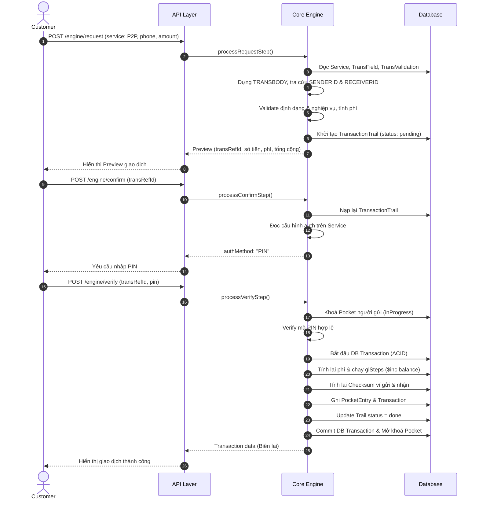
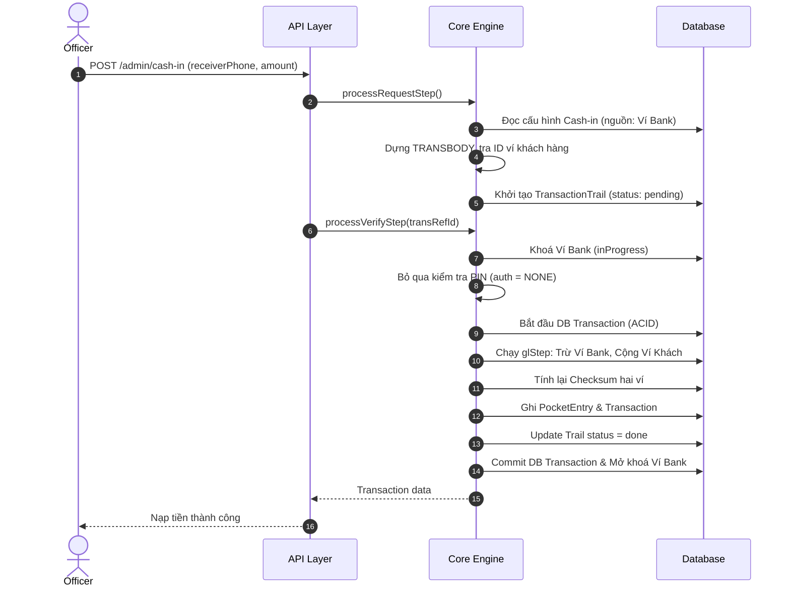
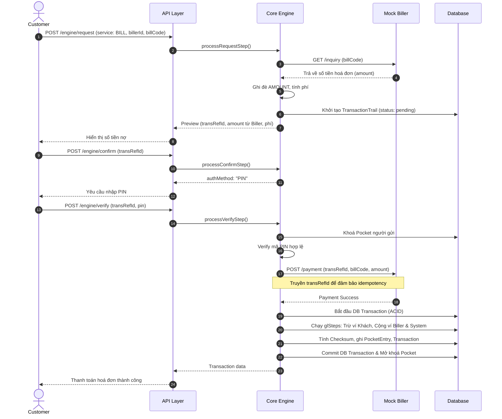

# 1. Overview

Hệ thống được chia thành 3 cụm mô hình dữ liệu chính:

## Cụm Configuration

- **Service**: Gốc cấu hình, chứa thông tin định danh nghiệp vụ, cơ chế xác thực (PIN/NONE), biểu phí và `fieldBuilder` (cách dựng biến từ request).
- **TransField**: Hợp đồng định dạng dữ liệu (kiểu, độ dài, bắt buộc) cho từng biến trong `TRANSBODY`.
- **TransValidation**: Các quy tắc kiểm tra logic nghiệp vụ (ví dụ: kiểm tra đủ số dư).
- **TransDefinition**: Kịch bản ghi sổ kép (`glSteps`), định nghĩa dòng tiền đi từ ví nào sang ví nào.

## Cụm Ledger & Runtime

- **Pocket**: Lưu trữ số dư (`balance`) và chuỗi mã hoá bảo vệ (`checksum`).
- **TransactionTrail**: Hồ sơ theo dõi toàn bộ vòng đời 1 giao dịch qua 3 bước (Request, Confirm, Verify) thông qua `transRefId`.
- **PocketEntry**: Nhật ký bút toán không thể sửa đổi (Immutable), ghi lại từng bước biến động số dư.
- **Transaction**: Biên lai cố định được sinh ra sau khi tiền đã chạy xong.

## Cụm Entity

- **Customer, Officer, Biller**: Các đối tượng tham gia hệ thống và sở hữu Pocket.

---

# 2. Sơ đồ tuần tự: Chuyển tiền P2P

Đây là luồng chuẩn 3 bước đi từ khách hàng. Nguồn tiền là ví Customer, đích là ví Customer.

---

# 3. Sơ đồ tuần tự: Cash-in (Medium)

Nghiệp vụ do Officer thực hiện. Server tự động chạy nối tiếp Request và Verify, bỏ qua Confirm vì Officer không cần xác thực PIN (`auth: NONE`). Nguồn tiền cố định từ ví bank.

---

# 4. Sơ đồ tuần tự: Thanh toán hoá đơn / Bill Payment (High)

Đặc thù: Số tiền không do người dùng nhập mà tra cứu từ hệ thống ngoài . Phải gọi sang đối tác để xác nhận thanh toán trước khi ghi sổ.

