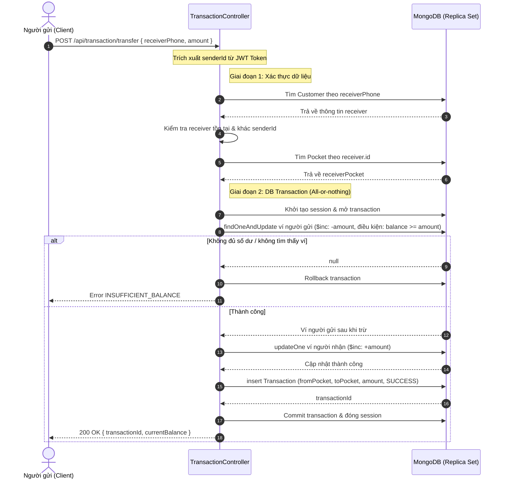

# Sequence Diagram - Luồng Chuyển Tiền (P2P)

```mermaid
sequenceDiagram
    autonumber
    actor Client as Người gửi (Client)
    participant API as TransactionController
    participant DB as MongoDB (Replica Set)

    Client->>API: POST /api/transaction/transfer { receiverPhone, amount }
    Note over API: Trích xuất senderId từ JWT Token

    Note right of API: Giai đoạn 1: Xác thực dữ liệu
    API->>DB: Tìm Customer theo receiverPhone
    DB-->>API: Trả về thông tin receiver
    API->>API: Kiểm tra receiver tồn tại & khác senderId
    API->>DB: Tìm Pocket theo receiver.id
    DB-->>API: Trả về receiverPocket

    Note right of API: Giai đoạn 2: DB Transaction (All-or-nothing)
    API->>DB: Khởi tạo session & mở transaction

    API->>DB: findOneAndUpdate ví người gửi ($inc: -amount, điều kiện: balance >= amount)

    alt Không đủ số dư / không tìm thấy ví
        DB-->>API: null
        API->>DB: Rollback transaction
        API-->>Client: Error INSUFFICIENT_BALANCE
    else Thành công
        DB-->>API: Ví người gửi sau khi trừ

        API->>DB: updateOne ví người nhận ($inc: +amount)
        DB-->>API: Cập nhật thành công

        API->>DB: insert Transaction (fromPocket, toPocket, amount, SUCCESS)
        DB-->>API: transactionId

        API->>DB: Commit transaction & đóng session
        API-->>Client: 200 OK { transactionId, currentBalance }
    end
```
